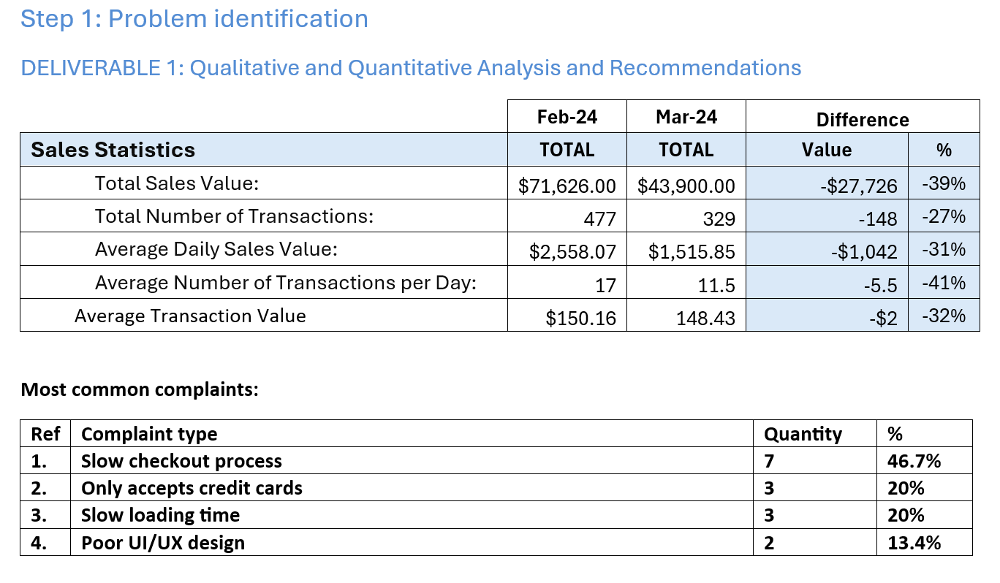
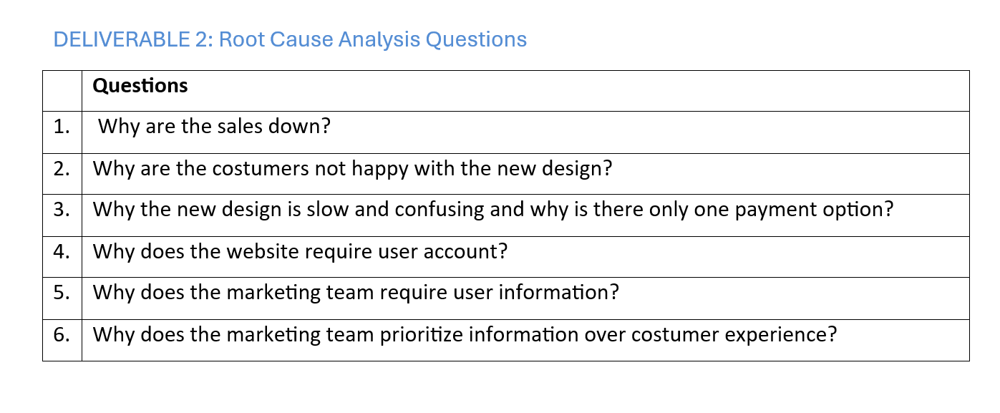
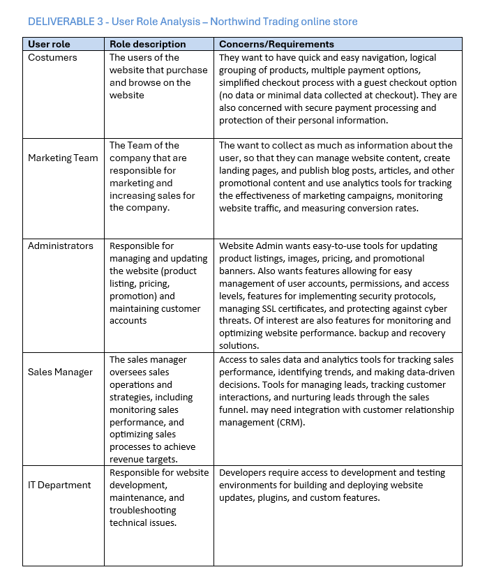
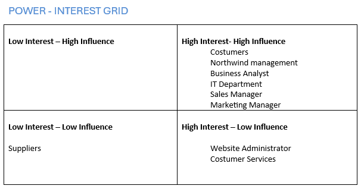
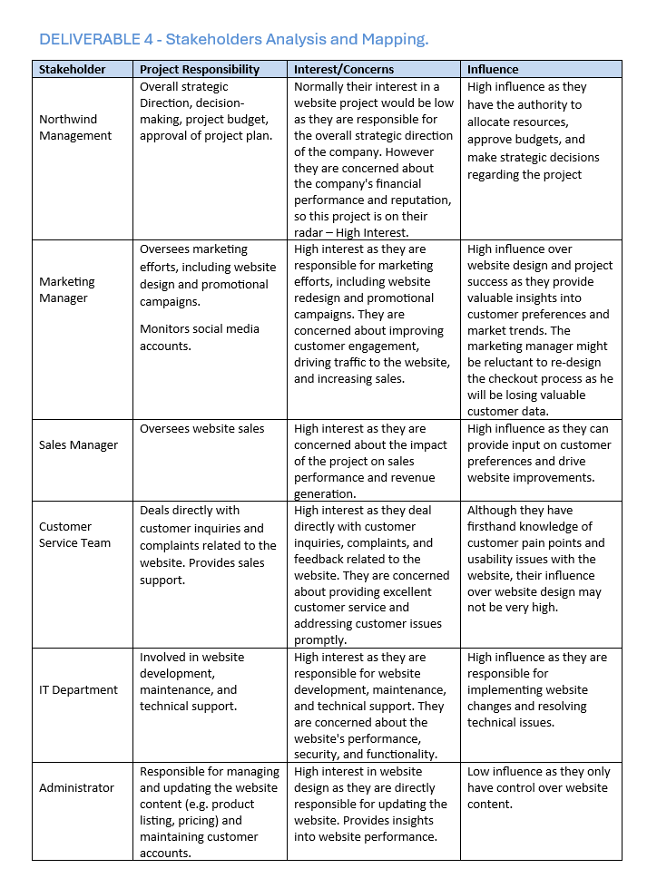
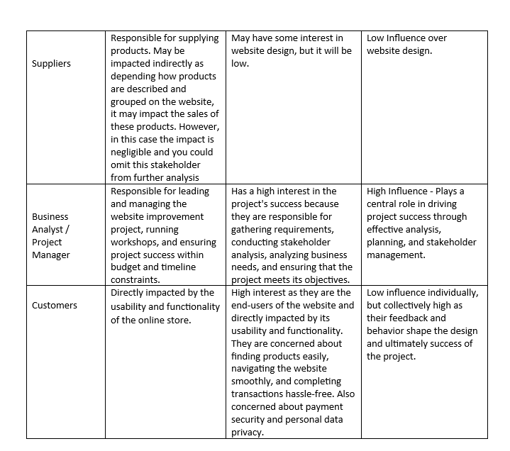
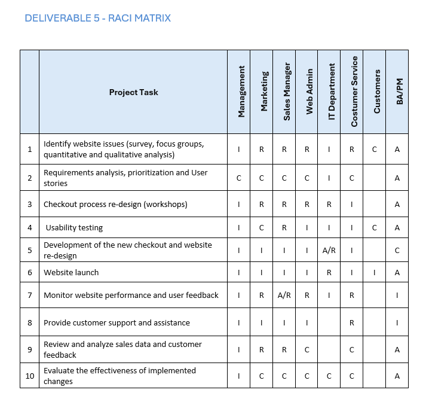

# 📑 Stakeholder Management Case Study – Northwind Trading
## 🔹 Project Case:

This case study *analyzes stakeholder management* for Northwind Trading, an eCommerce company experiencing *declining sales and negative customer feedback* after a website redesign. Using both *quantitative and qualitative data* , the project applies structured business analysis methods to identify root causes, analyze stakeholders, and recommend actionable solutions to balance customer satisfaction with business needs.

## 📜Executive Summary

In March 2024, Northwind Trading recorded a 39% decrease in total sales value and a **27% decrease** in the number of transactions compared to February 2024. Customer complaints highlighted issues with the new checkout process, limited payment options, and slow page loading. Through **stakeholder analysis(Root cause analysis, Stakeholder mapping, RACI Matrix and Role-based analysis)** and **structured problem-solving**, this case study identifies key concerns and **proposes solutions** to improve website performance, customer experience, and stakeholder alignment.

## 🧾Business Case
Northwind Trading, a successful eCommerce company for four years, recently faced its first decline in sales alongside negative customer feedback. The downturn followed a website redesign introducing mandatory customer registration during checkout, aimed at supporting marketing’s data collection goals. While no major technical faults were identified, slower page loads and customer dissatisfaction raised concerns. Management decided to **investigate** proactively to prevent further sales decline and reputational risk.

## 🧰Methodology
The methodology combined both quantitative and qualitative approaches to analyze Northwind Trading’s sales decline and stakeholder concerns. Sales data and customer complaints were examined to identify patterns, while **root cause analysis**, **stakeholder mapping**, and **role-based analysis** were applied to uncover underlying issues. Finally, a **RACI matrix** was developed to assign clear responsibilities and ensure accountability across stakeholders.

### Problem Identification

#### Here I used two methods for problem identification:

#️⃣**Quantitative Analysis:** Sales statistics from [Sales Data and Statistics.](./Data/Sales-Data-and-Statistics.xlsx)

🔢**Qualitative Analysis:** Review of [Sales Report and Customer Complaints.](./Data/Sales-Report-and-costumer-complaint.docx)
####

#### 📄Findings:

Sales decreased by 39% (Feb–Mar 2024).

##### Customer complaints (top issues):

Slow checkout process (47%)

Only credit card accepted (20%)

Slow loading times (20%)

Poor UI/UX (13%)

#### Conclusion: 
Decline linked to customer frustration with checkout and payment experience.

### Root Cause Analysis

#### 📄Findings:
The root cause is the marketing department’s decision to enforce mandatory customer registration without market research or customer validation. This led to resistance, lower conversions, and negative feedback.

### User Role Analysis

To understand the impact of the website redesign and align stakeholder interests, a user role analysis was conducted. This identified the primary roles interacting with or affected by the eCommerce platform and captured their needs, concerns, and requirements.

**Customers** – End-users who browse and purchase products. They require quick navigation, logical product grouping, multiple secure payment options, and a simplified checkout with a guest option. They are also concerned about data privacy.

**Marketing Team** – Focused on collecting user data to manage campaigns, landing pages, and promotional content. They rely on analytics to track conversions and optimize sales but risk prioritizing data collection over customer experience.

**Administrators** – Responsible for updating product listings, pricing, and promotions. They need user-friendly tools for managing content, accounts, and site security, as well as monitoring performance and backups.

**Sales Manager** – Oversees sales performance and strategies. Needs access to analytics and CRM tools to track customer interactions, identify trends, and drive revenue growth.

**IT Department** – Manages technical development, security, and troubleshooting. Requires environments for deploying updates, plugins, and features, and is accountable for ensuring performance and reliability.

#### 📄Findings:

This analysis highlighted conflicting priorities between customers (who want speed and simplicity) and the marketing team (who want more data), making stakeholder management critical for resolving the sales decline.

### Stakeholder Management
#### Key Stakeholders: Power Interest Grid

#### Stakeholder Needs

Customers: Quick checkout, multiple payment options, secure data.

Marketing: Customer data for promotions & analytics.

IT Department: Performance, security, technical fixes.

Sales Manager: Reliable data for monitoring sales and revenue.

  

  

### RACI Matrix

(R = Responsible, A = Accountable, C = Consulted, I = Informed)

## Conclusion:

As the last step, we allocated responsibilities for completing various project tasks to various stakeholders and ensured clarity and accountability of the roles and responsibilities by presenting the stakeholders with a RACI Matrix. 
By applying these techniques, we had an opportunity to deepen your understanding of problem-solving and stakeholder management, setting the stage for your future successful execution and delivery of project. 

## 📄Results

*Findings:* Sales decline caused by poor checkout design and limited payment options.

#### Recommendations:

1. Add guest checkout option.

2. Support multiple payment methods (PayPal, Apple Pay, Google Pay).

3. Optimize site performance (faster load times, product grouping).

4. Incentivize voluntary registration instead of mandatory sign-ups.

5. Improve monitoring of customer feedback loops.

###### 📂 Included in this repo: 
1. [Sales Report and Customer Complaints](./Data/Sales-Report-and-costumer-complaint.docx)
2. [Sales Data and Statistics](./Data/Sales-Data-and-Statistics.xlsx)
3. [Problem Identification and Stakeholder Management](./Problem-Identification-and-Stakeholder-Management---Workbook.docx)
